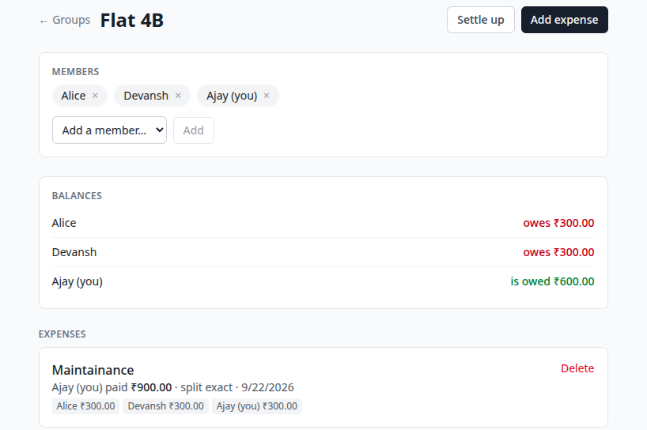
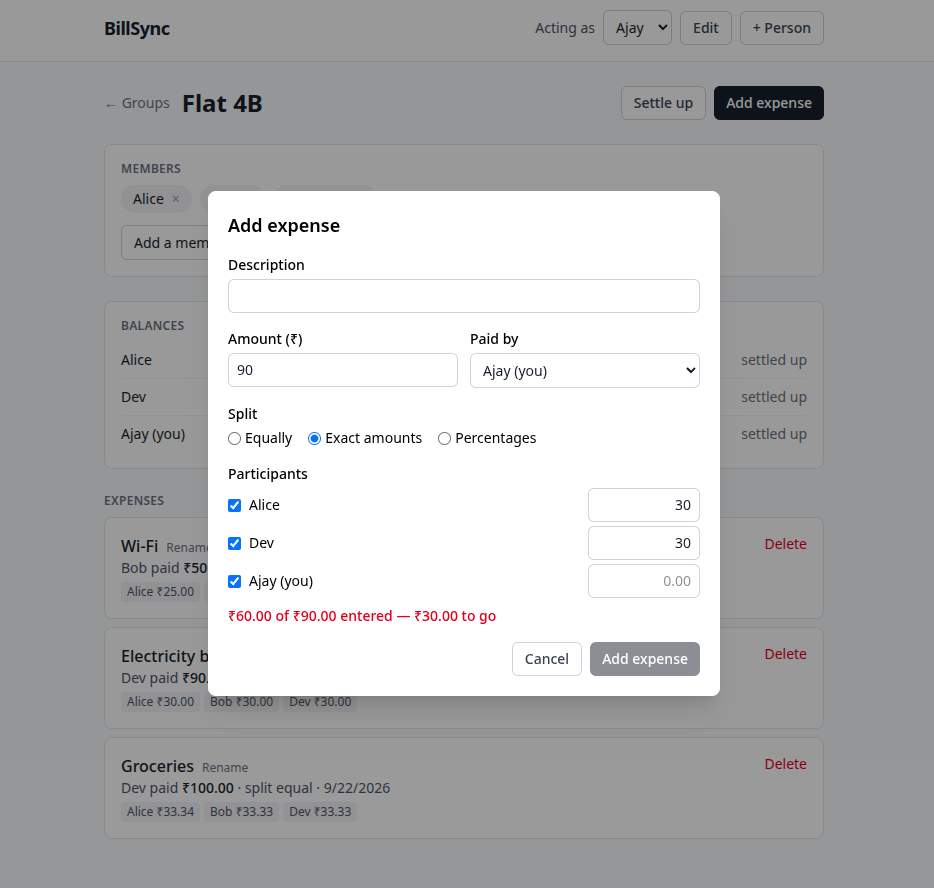
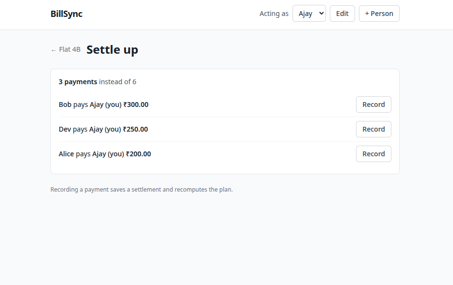
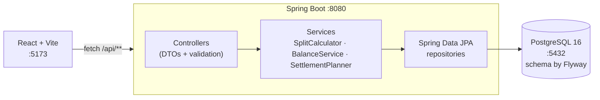

# BillSync

A group expense splitter: people join groups, log expenses, and BillSync works out who owes whom, then collapses that into the fewest sensible payments.



| Add an expense with an exact split | Settle up |
| --- | --- |
|  |  |

## Stack

**Backend** — Java 21, Spring Boot 4.1, Spring Web MVC, Spring Data JPA (Hibernate 7), Bean Validation, Flyway, PostgreSQL 16 (dev) / H2 (tests), springdoc-openapi, JUnit 5, AssertJ, Mockito.

**Frontend** — React 19, Vite, TypeScript, Tailwind CSS, React Router. `fetch` behind a small typed client; no Axios, no state library, no component kit.

## Architecture



Money is `NUMERIC(12,2)` in the database, `BigDecimal` in Java, and a **string** (`"33.34"`) on the wire, so a floating-point number never touches a rupee anywhere in the system.

## Quickstart

Needs JDK 21, Node 20+, and Docker (or Podman with `podman-compose` and the `podman-docker` shim). Maven is not required; the wrapper downloads it.

```bash
git clone https://github.com/uttkarsh-thakur26/billsync.git
cd billsync

# 1. database
docker compose up -d

# 2. backend (new terminal)
cd backend && ./mvnw spring-boot:run

# 3. frontend (new terminal)
cd frontend && npm install && npm run dev
```

Then open <http://localhost:5173>. Swagger UI is at <http://localhost:8080/swagger-ui.html>.

Flyway creates the schema on first boot. `docker compose up -d` is step one of every session, not just the first: the data lives in a named volume, but the container does not restart on its own.

To run the tests:

```bash
cd backend && ./mvnw test
```

The tests use in-memory H2 and need neither Docker nor a running backend.

## API

Sixteen endpoints under `/api`. Full request and response schemas are in Swagger.

| Method | Path | Purpose |
| --- | --- | --- |
| POST | `/api/users` | Create a user |
| GET | `/api/users` | List users |
| PATCH | `/api/users/{id}` | Rename a user or change their email |
| DELETE | `/api/users/{id}` | Delete a user who is in no group and has no recorded history |
| POST | `/api/groups` | Create a group (optionally with initial members) |
| GET | `/api/groups` | List groups with members |
| GET | `/api/groups/{id}` | Group detail with members |
| POST | `/api/groups/{id}/members` | Add a member |
| DELETE | `/api/groups/{id}/members/{userId}` | Remove a member (only when their balance is zero) |
| POST | `/api/groups/{id}/expenses` | Add an expense |
| GET | `/api/groups/{id}/expenses` | List a group's expenses, newest first |
| PATCH | `/api/expenses/{id}` | Change an expense's description |
| DELETE | `/api/expenses/{id}` | Delete an expense |
| GET | `/api/groups/{id}/balances` | Net balance per member |
| GET | `/api/groups/{id}/settlement-plan` | The simplified list of payments |
| POST | `/api/groups/{id}/settlements` | Record a payment between two members |

### Example

```http
POST /api/groups/1/expenses
Content-Type: application/json

{
  "paidByUserId": 3,
  "amount": "100.00",
  "description": "Dinner at Truffles",
  "splitType": "EQUAL",
  "participantUserIds": [1, 2, 3]
}
```

```json
{
  "id": 42,
  "groupId": 1,
  "paidByUserId": 3,
  "amount": "100.00",
  "description": "Dinner at Truffles",
  "splitType": "EQUAL",
  "shares": [
    { "userId": 1, "amountOwed": "33.34" },
    { "userId": 2, "amountOwed": "33.33" },
    { "userId": 3, "amountOwed": "33.33" }
  ],
  "createdAt": "2026-09-21T20:15:00Z"
}
```

For `EXACT` and `PERCENTAGE` splits, add `"splitValues": { "1": "70.00", "2": "30.00" }` keyed by user id, one entry per participant.

```http
GET /api/groups/1/settlement-plan
```

```json
{
  "groupId": 1,
  "transactionCount": 2,
  "naiveTransactionCount": 3,
  "transactions": [
    { "fromUserId": 2, "toUserId": 3, "amount": "63.33" },
    { "fromUserId": 1, "toUserId": 3, "amount": "3.34" }
  ]
}
```

### Errors

One shape everywhere, produced by a single `@RestControllerAdvice`:

```json
{
  "timestamp": "2026-09-21T20:15:00Z",
  "status": 400,
  "error": "Validation failed",
  "details": ["Exact split amounts must sum to the expense total: amounts sum to 99.99 but the expense is 100.00"]
}
```

`400` for validation and business-rule failures, `404` for unknown resources, `409` for duplicate emails and duplicate memberships.

### Correcting mistakes

A typo in a description is fixed in place. Anything that moves money is not: there is no endpoint to change an expense's amount, payer or split, and no delete for settlements, on purpose. A wrong expense is deleted and re-added; its shares go with it. A wrong settlement is corrected by recording the reverse payment, which nets it to zero: the ledger is append-only and history is never rewritten. A member can be removed only when their balance in the group is exactly zero, and their past expenses stay on record. A person can be deleted only once they are in no group and named in no expense or settlement; the foreign keys enforce the second part, so it cannot be bypassed.

## Splitting with exact paise

Split ₹100.00 equally three ways and each share is ₹33.333…, which rounds to ₹33.33. Three of those add up to ₹99.99. A paisa has vanished, and after a few hundred expenses the balances no longer reconcile.

**The invariant: the shares of an expense sum to the expense amount exactly.** Not approximately. Every test in `SplitCalculatorTest` asserts it, including brute-force sweeps over every amount from ₹0.01 to ₹20.00 split 1 to 12 ways.

How `SplitCalculator` keeps it, for ₹100.00 split between users 1, 2 and 3:

1. Base share = `100.00 ÷ 3` rounded **down** to two decimals = `33.33`. Rounding down means the error is only ever a shortfall, never an overshoot, and the shortfall is a whole number of paise strictly smaller than the number of participants.
2. Remainder = `100.00 − 3 × 33.33` = `0.01`.
3. Hand the remainder out one paisa at a time to participants in **ascending user-id order**: user 1 gets `33.34`, users 2 and 3 keep `33.33`. Sum: `100.00`.

Ordering by id rather than by input order makes the result deterministic: the same expense always produces the same shares, whichever order the client listed the participants in.

`PERCENTAGE` splits get the same treatment. `EXACT` splits get no correction at all: the client stated the amounts, so if they do not add up the request is rejected with a `400`.

Why not `double`? `0.1 + 0.2` is `0.30000000000000004`. Three shares of `33.33` sum to `99.99000000000001`. Balances that should be zero come out at `-1.4E-14`, "who owes whom" is never empty, and no test can assert equality. `BigDecimal` with a fixed scale of 2 stores the exact decimal and forces the programmer to choose the rounding mode instead of the CPU choosing it.

## Debt simplification

After a few expenses a group is a tangle: A owes B ₹200, B owes C ₹150, C owes A ₹80. Nobody wants to make three transfers for that.

`SettlementPlanner` does the following:

1. Compute each member's **net balance**: everything they paid, minus everything they owe, adjusted for settlements already recorded. Positive means the group owes them, negative means they owe the group. Across a group the balances always sum to zero.
2. Drop everyone at zero.
3. Put creditors in a max-heap by amount and debtors in a max-heap by amount.
4. Pop the biggest creditor and the biggest debtor, settle `min(credit, debt)` between them, and push back whichever of the two still has a remainder.
5. Repeat until both heaps are empty.

Every step fully clears at least one person, so a group with *n* non-zero balances needs **at most n − 1 payments**. The 3-person cycle above becomes two: A pays C ₹70 and A pays B ₹50. The 5-person, 8-debt group in `SettlementPlannerTest` settles in 4.

**That is a bound, not the true minimum.** The genuine optimum is *n* minus the largest number of disjoint subsets of people whose balances sum to zero, since each such subset settles on its own. Finding those subsets is the partition problem, which is NP-hard. For a group of 4 to 10 people the greedy answer is optimal or one payment off, and it runs in O(n log n) with a deterministic result, so greedy is the right engineering choice. Knowing that it *is* a choice is the point.

One more thing the tests turned up: greedy is not guaranteed to beat paying every debt directly. With three unrelated debts (A→B ₹7, C→D ₹9, E→B ₹3) direct payment takes 3 transfers, but greedy pairs the biggest creditor B with the biggest debtor C, who never owed B anything, and needs 4. So the planner computes both, reports the direct count as `naiveTransactionCount`, and returns whichever plan is shorter. The result is never worse than the direct graph and never more than n − 1.

## Design notes

- **`expense_groups`, not `groups`.** `GROUP` is a reserved word in PostgreSQL; naming the table `groups` means quoting it in every query forever.
- **Flyway owns the schema; Hibernate only validates.** `ddl-auto: validate` in dev means an entity that disagrees with the migration fails at startup, not with a 500 at runtime. Tests run against H2 with the schema generated from the entities, so they need no Docker.
- **`open-in-view: false` and `LAZY` everywhere.** Lazy loads happen deliberately inside a `@Transactional` service or not at all. The queries that need related rows say so with `@EntityGraph`, so loading a group with 20 members is one `SELECT` with two `LEFT JOIN`s, not 22 queries.
- **DTOs in, DTOs out.** Entities never reach the controller layer, so the JSON contract cannot change by accident when a mapping does.
- **No authentication.** Users are records; the UI has an "acting as" selector. Adding Spring Security here would double the project for no gain in what it demonstrates.

## Out of scope

Payments, currency conversion, receipt uploads, notifications, dark mode, mobile app.
